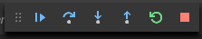
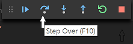

# Configure VS Code for Mingw-w64 and GCC

In this tutorial, you configure Visual Studio Code on Windows to use the g++ compiler and gdb debugger in [Mingw-w64](http://mingw-w64.org/doku.php/start). The configuration applies to a single project folder hierarchy, but you can easily copy the configuration files to other folders where the same settings are required. After configuring VS Code, you will compile and debug a simple program to get familiar with the VS Code user interface. After completing this tutorial, you will be ready to create and configure your own workspace, and to explore the VS Code documentation for further information about its many features. This tutorial does not teach you about GCC or Linux or the C++ language. For those subjects there are many good resources available on the Web.

If you have any problems, feel free to file an issue for this tutorial in the [VS Code documentation repository](https://github.com/Microsoft/vscode-docs/issues).

## Prerequisites

To successfully complete this tutorial, you must do the following:

1. Install [Visual Studio Code for Windows](https://code.visualstudio.com/docs/?dv=win).

1. Install the [C++ extension for VS Code](https://marketplace.visualstudio.com/items?itemName=ms-vscode.cpptools).

1. Install [Mingw-w64](http://mingw-w64.org/doku.php/download/mingw-builds) to a folder that has no spaces in its path (in other words, NOT the default location of "C:/Program Files/").

1. Install a *nix shell program such as Bash. If you have installed Git for Windows, you already have a Bash shell that the extension can discover and use for its integrated Terminal. If you don't have Git for Windows installed, then you can install bash.exe as part of [MSYS2](https://sourceforge.net/projects/msys2/). 
1. Add the paths to your Bash shell and to your mingw-w64 `bin` folder to the Windows PATH environment variable. The extension will pass this environment variable to the Bash shell when it opens it.


## Start VS Code in a workspace folder

At a command prompt or terminal, create an empty folder called "hello" or whatever you like, navigate into it, and open VS Code (`code`) in that folder (`.`) by entering the following commands:

```bash
mkdir hello
cd hello
code .
```
By starting VS Code in a folder, that folder becomes your "workspace". VS Code stores user settings that are specific to that workspace in `.vscode/settings.json`, which are separate from user settings that are stored globally. In this tutorial, we'll add three additional files to the `.vscode` folder:

- `c_cpp_properties.json` to specify the compiler path
- `tasks.json` to specify how to build the executable
- `launch.json` to specify debugger settings

## Configure the compiler path

Press **Ctrl+Shift+P** to open the Command Palette. Start typing "C/C++" and then choose **Edit Configurations** from the list of suggestions. VS Code creates a file called `c_cpp_properties.json` and populates it with some default settings. Find the `compilerPath` setting and paste in the path to the `bin` folder. In a Mingw-w64 installation, for example for version 8.1.0, it will be something like this, depending on which version you have installed: `C:\mingw-w64\x86_64-8.1.0-win32-seh-rt_v6-rev0\mingw64\bin\g++.exe`. (Note that this is not the default location, which is problematic due to the space in "Program Files".)

The `compilerPath` setting is the most important setting in yor configuration. The extension uses it to infer the path to system header files, which it needs for IntelliSense support. There is no need to specify it explicitly in the `includePath` setting unless you have additional or non-standard paths in your code base. In fact, we recommend that you delete the setting entirely if you don't need it. The only other change is to set `intelliSenseMode` to `gcc-x64"`. Your complete `c_cpp_properties.json` file should look something like this:

```json
{
    "configurations": [
        {
            "name": "Win32",
            "defines": [ 
                "_DEBUG",
                "UNICODE"
            ],
            "compilerPath": "C:/mingw-w64/x86_64-8.1.0-win32-seh-rt_v6-rev0/mingw64/bin/",
            "intelliSenseMode": "gcc-x64",
            "browse": {
                "path": [
                    "${workspaceFolder}"
                ],
                "limitSymbolsToIncludedHeaders": true,
                "databaseFilename": ""
            }
        }
    ],
    "version": 4
}
```

## Create a build task

Next, let's edit `tasks.json` to add a build task for our program. The `label` value will be used to identify the task in the VS Code Command Palette; you can name this whatever you like. The `args` array specifies the command line arguments that will be passed to the compiler that was specified in the previous step. These arguments must be specified in the order expected by the compiler. 

The `"isDefault": true` value in the `group` object specifies that this task will be run when you press **Ctrl+Alt+B**.

Your complete `tasks.json` file should look something like this:

```json
{
    // See https://go.microsoft.com/fwlink/?LinkId=733558
    // for the documentation about the tasks.json format
    "version": "2.0.0",
    "tasks": [
        {
            "label": "build hello world",
            "type": "shell",
            "command": "g++",
            "args": [
                "-g",
                "-o",
                "helloworld",
                "helloworld.cpp"
            ],
            "group": {
                "kind": "build",
                "isDefault": true
            }
        }
    ] 
}
```

## Configure debug settings

Next, we'll configure VS Code to launch gdb when we press *F5* to debug the program. Note that
the program name `helloworld.exe` matches what we specified in `tasks.json`. You will need to adjust your `miDebuggerPath` value to exactly match the path to your Mingw-w64 installation. 

By default, the C++ extension adds a breakpoint to the first line of `main`. The `stopAtEntry` value is set to `true` to cause the debugger to stop on that breakpoint. You can set this to `false` if you prefer to ignore it.

Your complete `launch.json` file should look something like this:

```json
   "version": "0.2.0",
    "configurations": [
        
        {
            "name": "(gdb) Launch",
            "type": "cppdbg",
            "request": "launch",
            "program": "${workspaceFolder}/helloworld.exe",
            "args": [],
            // set to false to ignore the breakpoint set by VS Code:
            "stopAtEntry": true, 
            "cwd": "${workspaceFolder}",
            "environment": [],
            "externalConsole": false,
            "MIMode": "gdb",
            // modify to match your specific install location:
            "miDebuggerPath": "C:/mingw-w64/x86_64-8.1.0-win32-seh-rt_v6-rev0/mingw64/bin/gdb.exe",
            "setupCommands": [
                {
                    "description": "Enable pretty-printing for gdb",
                    "text": "-enable-pretty-printing",
                    "ignoreFailures": true
                }
            ]
        }
    ]
}
```

## Add a source code file

1. In the main VS Code menu, click on **File > New File** and name it `helloworld.cpp`. 
1. Paste in this source code:

    ```cpp
    #include <iostream>
    #include <vector>
    #include <string>
    
    using namespace std;
    
    int main()
    {
    
        vector<string> msg {"Hello", "C++", "World", "from", "VS Code!"};
    
        for (const string& word : msg)
        {
            cout << word << " ";
        }
        cout << endl;
    }
    ```

1. Now press **Ctrl+S** to save the file. Now notice how all the files we have just edited appear in the **File Explorer** view in the left panel of VS Code:


This same panel is also used for source control, debugging, searching and replacing text, and managing extensions. The buttons on the left control those views. We'll look at the **Debug View** later in this tutorial. You can find out more about the other views in the VS Code documentation.

## Explore IntelliSense

In your new `helloworld.cpp` file, hover over `vector` or `string` to see type information. After the declaration of the `msg` variable, start typing `msg.` as you would when calling a member function. You should immediately see a completion list that shows all the member functions, and a window that shows the type information for the `msg` object:


## Build the program

1. To run the build task that you defined in tasks.json, press **Ctrl+Shift+B** or from the main menu choose **View > Command Palette** and start typing "Tasks: Run Build Task". The option will appear before you finish typing. 
1. When the task starts, you should see the integrated Terminal window appear below the code editor. After the task completes, the terminal shows output from the compiler that indicates whether the build succeeded or failed. For a successful g++ build, the output looks something like this:


1. As the message instructs, press any key to close the build message; the terminal now returns to the shell command prompt.

## Start a debugging session

1. You are now ready to run the program. Press **F5** or from the main menu choose **Debug > Start Debugging**. Before we start stepping through the code, let's take a moment to notice several changes in the user interface: 

- The Terminal shows the command line that was used to start gdb. It shows the paths to the C++ extension, as well as to our mingw-w64 installation. In general, we should never need to be concerned with the details here:

    ```cmd
    $ env "c:\Users\satyan\.vscode\extensions\ms-vscode.cpptools-0.21.0\debugAdapters\bin\WindowsDebugLauncher.exe" --std
    in=Microsoft-MIEngine-In-slkzoloe.km0 --stdout=Microsoft-MIEngine-Out-b2nqrdmk.cc2 --stderr=Microsoft-MIEngine-Error-
    f42jy5qt.jfs --pid=Microsoft-MIEngine-Pid-32dwsmv3.tuh --dbgExe=C:/mingw-w64/x86_64-8.1.0-win32-seh-rt_v6-rev0/mingw6
    4/bin/gdb.exe --interpreter=mi
    ```

- The code editor highlights the first statement in the `main` method. This is a breakpoint that the C++ extension automatically sets for you: 


- The workspace pane on the left now shows debugging information: 


- At the top of the code editor, a debugging control panel appears. You can move this around the screen by grabbing the dots on the left side.



## Step through the code

Now we're ready to start stepping through the code. 

1. Click or press the "Step over" icon in the debugging control panel. 

    

    This will advance program execution to the first line of the for loop, and skip over all the internal function calls within the `vector` and `string` classes that are invoked when the `msg` variable is created and initialized. Notice the change in the **Variables** window on the left. In this case, the errors are expected because, although the variable names for the loop are now visible to the debugger, the statement has not executed yet, so there is nothing to read at this point. The contents of `msg` are visible, however, because that statement has completed. 
1. Press **Step over** again to advance to the next statement in this program (skipping over all the internal code that is executed to initialize the loop). Now, the **Variables** window shows information about the loop variables. 
1. Press **Step over** again to execute the `cout` statement. In the **Terminal** window, you now see "Hello".
1. If you like, you can keep pressing **Step over** until all the words in the vector have been printed to the console. But if you are curious, try pressing the **Step Into** button to step through source code in the C++ standard library! 

    

    To return to your own code, one way is keep pressing **Step over**. Another way is to set a breakpoint in your code by switching to the `helloworld.cpp` tab in the code editor, putting the insertion point somewhere on the `cout` statement inside the loop, and pressing **F9**. A red dot appears in the gutter on the left to indicate that a breakpoint has been set on this line. 

    

    Then press **F5** to start execution from the current line in the standard library header. Execution will break on `cout`. If you like, you can press **F9** again to toggle the breakpoint off.

## Set a watch

Sometimes you might want to keep track of the value of a variable as your program executes. You can do this by setting a *watch* on the variable. 

1. Place the insertion point inside the loop. In the **Watch** window, click the plus sign and in the text box, type `word`, which is the name of the loop variable. Now view the Watch window as you step through the loop.
1. Add another watch by adding this statement before the loop: `int i = 0;`. Then, inside the loop, add this statement: `++i;`. Now add a watch for `i` as you did in the previous step. 

## Next steps


