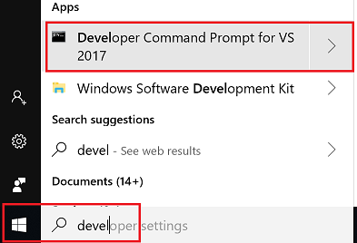
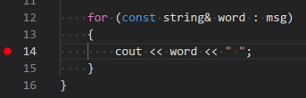

# Configure VS Code for Microsoft C++

In this tutorial, you configure Visual Studio Code on Windows to use the Microsoft C++ compiler and debugger. The configuration applies to a single project folder hierarchy, but you can easily copy the configuration files to other folders where the same settings are required. After configuring VS Code, you will compile and debug a simple program to get familiar with the VS Code user interface. After completing this tutorial, you will be ready to create and configure your own workspace, and to explore the VS Code documentation for further information about its many features. This tutorial does not teach you details about Windows or the Microsoft C++ toolset or the C++ language. For those subjects there are many good resources available on the Web.

If you have any problems, feel free to file an issue for this tutorial in the [VS Code documentation repository](https://github.com/Microsoft/vscode-docs/issues).

## Prerequisites

To successfully complete this tutorial, you must do the following:

1. Install [Visual Studio Code for Windows](https://code.visualstudio.com/docs/?dv=win).
1. Install the [C++ extension for VS Code](https://marketplace.visualstudio.com/items?itemName=ms-vscode.cpptools).

1. Install the Microsoft C++ (MSVC) compiler toolset. 
    a. If you have a recent version of Visual Studio, open the Visual Studio Installer from the Windows Start menu and verify that the C++ workload is checked. 
    b. Download the standalone toolset by clicking the Visual Studio Build Tools link on the [Downloads page](https://visualstudio.microsoft.com/downloads/#other) and follow the prompts. With the default settings, the download size is about 1GB and the size on disk is about 4GB. If you don't require CMake support (and the Windows SDK that it depends on) the size on disk should be about 3GB.
 

## Start VS Code from a developer command prompt in a workspace folder

To use VS Code with MSVC, you must start VS Code from a developer command prompt. (An ordinary Windows command prompt, or a Bash prompt, does not have the necessary environment variables set.)

1. To open the developer command prompt, start typing "Developer" in the Windows Start menu, and you should see it appear in the list of suggestions. The exact name depends on which version of Visual Studio or the Visual Studio Build Tools you have installed. Click on the entry to open the prompt. 



1. Next, create an empty folder called "hello" or whatever you like, navigate into it, and open VS Code (`code`) in that folder (`.`) by entering the following commands:

```cmd
mkdir hello
cd hello
code .
```
By starting VS Code in a folder, that folder becomes your "workspace". VS Code stores user settings that are specific to that workspace in `.vscode/settings.json`, which are separate from user settings that are stored globally. In this tutorial, we'll add three additional files to the `.vscode` folder to configure the workspace to target MSVC:

- `c_cpp_properties.json` to specify the compiler and include paths.
- `tasks.json` to specify how to build the executable
- `launch.json` to specify debugger settings

## Configure the compiler path

1. Press **Ctrl+Shift+P** to open the **Command Palette**. Start typing "C/C++" and then choose **Edit Configurations** from the list of suggestions. VS Code creates a file called `c_cpp_properties.json` and populates it with some default settings. The `compilerPath` setting is the most important setting in yor configuration. Find the `compilerPath` setting and paste in the path to cl.exe. In a default Visual Studio 2017 Build Tools installation, it will be something like this, depending on which specific version you have installed: `C:/Program Files (x86)/Microsoft Visual Studio/2017/BuildTools/VC/Tools/MSVC/14.16.27023/bin/Hostx64/x64`.

1. Change the `intelliSenseMode` value to `"msvc-x64"`.
 
The extension can now infer the path to the MSVC include folder, which it needs for IntelliSense support. There is no need to specify the `includePath` value explicitly unless you have additional paths to header files in your code base. 

Your complete `c_cpp_properties.json` file should like something like this:

```json
{
    "configurations": [
        {
            "name": "Win32",
            "defines": [ 
                "_DEBUG",
                "UNICODE"
            ],
            "compilerPath": "C:/Program Files (x86)/Microsoft Visual Studio/2017/BuildTools/VC/Tools/MSVC/14.16.27023/bin/Hostx64/x64",
            "intelliSenseMode": "msvc-x64",
            "browse": {
                "path": [
                    "${workspaceFolder}"
                ],
                "limitSymbolsToIncludedHeaders": true,
                "databaseFilename": ""
            }
        }
    ],
    "version": 4
}
```

## Create a build task

Next, let's edit `tasks.json` to add a build task for our program. The `label` value will be used in the VS Code Command Palette and can be whatever name you like. The `command` value says that we are using `cl.exe`, the MSVC compiler. The `args` array specifies the command line arguments that will be passed to the compiler that was specified in the previous step. They must appear in the order expected by the compiler. Note that currently you must use a dash (for example, -EHsc) before any [MSVC compiler options](https://docs.microsoft.com/en-us/cpp/build/reference/compiler-options), even though the compiler itself also allows slashes (for example, /EHsc). In this example, we are specifying the exception handling mode (EHsc) and telling the compiler to produce a debug build with symbols (Zi). The `-o` argument tells the compiler to name the executable "helloworld.exe". 

> [!NOTE]
> The `-o` argument is deprecated, but we have to use it here due to an issue with how the C++ extension handles the `-out` argument.

The `group` value specifies that this task will be run when you press **Ctrl+Alt+B**.

Your complete `tasks.json` file should look something like this:

```json
{
    // See https://go.microsoft.com/fwlink/?LinkId=733558
    // for the documentation about the tasks.json format
    "version": "2.0.0",
    "tasks": [
        {
            "label": "msvc build",
            "type": "shell",
            "command": "cl.exe",
            "args": [
                "-EHsc",
                "-Zi",               
                "main.cpp",
                "-o",
                "helloworld.exe"
            ],
            "group":  {
                "kind": "build",
                "isDefault": true
            },
            "presentation": {
                // Reveal the output only if unrecognized errors occur.
                "reveal":"always"
            },
            // Use the standard MS compiler pattern to detect errors, warnings and infos
            "problemMatcher": "$msCompile"
        }
    ]
}

```

## Configure debug settings

Finally, we'll configure VS Code to launch the Visual Studio debugger when we press *F5* to debug the program. Note that
the program name `helloworld.exe` matches what we specified in `tasks.json`. 

By default, the C++ extension adds a breakpoint to the first line of `main`. The `stopAtEntry` value is set to `true` to cause the debugger to stop on that breakpoint. You can set this to `false` if you prefer to ignore it. 

Your complete `launch.json` file should look something like this:


```json
   "version": "0.2.0",
    "configurations": [
        
        {
            "name": "(msvc) Launch",
            "type": "cppvsdbg",
            "request": "launch",
            "program": "${workspaceFolder}/helloworld.exe",
            "args": [],
            // set to false to ignore the breakpoint set by VS Code:
            "stopAtEntry": true, 
            "cwd": "${workspaceFolder}",
            "environment": [],
            "externalConsole": false
        }
    ]
}
```

## Add a source code file

1. In the main VS Code menu, click on **File > New File** and name it `helloworld.cpp`. 
1. Paste in this source code:

    ```cpp
    #include <iostream>
    #include <vector>
    #include <string>
    
    using namespace std;
    
    int main()
    {
    
        vector<string> msg {"Hello", "C++", "World", "from", "VS Code!"};
    
        for (const string& word : msg)
        {
            cout << word << " ";
        }
        cout << endl;
    }
    ```

1. Now press **Ctrl+S** to save the file. Now notice how all the files we have just edited appear in the **File Explorer** view in the left panel of VS Code:


This same panel is also used for source control, debugging, searching and replacing text, and managing extensions. The buttons on the left control those views. We'll look at the **Debug View** later in this tutorial. You can find out more about the other views in the VS Code documentation.

## Build the program

1. To run the build task that you defined in tasks.json, press **Ctrl+Shift+B** or from the main menu choose **View > Command Palette** and start typing "Tasks: Run Build Task". The option will appear before you finish typing. 

> [!NOTE] If you see an error message that looks like this: */bin/bash: cl.exe: command not found* it means you have not started VS Code from a developer command prompt. See the first section of this tutorial for more information.

1. When the task starts, you should see the integrated Terminal window appear below the code editor. After the task completes, the terminal shows output from the compiler that indicates whether the build succeeded or failed. For a successful MSVC build, the output looks something like this:


1. As the message instructs, press any key to close the build message; the terminal now returns to the shell command prompt.

## Start a debugging session

1. You are now ready to run the program. Press **F5** or from the main menu choose **Debug > Start Debugging**. Before we start stepping through the code, let's take a moment to notice several changes in the user interface: 

- The Terminal shows the command line that was used to start gdb. It shows the paths to the C++ extension, as well as to our mingw-w64 installation. In general, we should never need to be concerned with the details here:

    ```cmd
    $ env "c:\Users\satyan\.vscode\extensions\ms-vscode.cpptools-0.21.0\debugAdapters\bin\WindowsDebugLauncher.exe" --std
    in=Microsoft-MIEngine-In-slkzoloe.km0 --stdout=Microsoft-MIEngine-Out-b2nqrdmk.cc2 --stderr=Microsoft-MIEngine-Error-
    f42jy5qt.jfs --pid=Microsoft-MIEngine-Pid-32dwsmv3.tuh --dbgExe=C:/mingw-w64/x86_64-8.1.0-win32-seh-rt_v6-rev0/mingw6
    4/bin/gdb.exe --interpreter=mi
    ```

- The code editor highlights the first line in the `main` method. This is a breakpoint that the C++ extension automatically sets for you: 


- The workspace pane on the left now shows debugging information, but there isn't any useful information yet because no program statements have been executed yet, other than some system startup code which is reflected in the Threads window: 


- At the top of the code editor, a debugging control panel appears. You can move this around the screen by grabbing the dots on the left side.


## Step through the code

Now we're ready to start stepping through the code. 

1. Click or press the "Step over" icon in the debugging control panel until the `for (const string& word : msg)` statement is highlighted. 

    

    The **Step Over** command skip over all the internal function calls within the `vector` and `string` classes that are invoked when the `msg` variable is created and initialized. Notice the change in the **Variables** window on the left. In this case, the errors are expected because, although the variable names for the loop are now visible to the debugger, the statement has not executed yet, so there is nothing to read at this point. The contents of `msg` are visible, however, because that statement has completed. 
1. Press **Step over** again to advance to the next statement in this program (skipping over all the internal code that is executed to initialize the loop). Now, the **Variables** window shows information about the loop variables. 
1. Press **Step over** again to execute the `cout` statement. In the **Terminal** window, you now see "Hello". **Note** In the current version of the extension, the output is not displayed until the loop completes. This issue will be fixed in a future update.
1. If you like, you can keep pressing **Step over** until all the words in the vector have been printed to the console. But if you are curious, try pressing the **Step Into** button to step through source code in the C++ standard library! 

    

    To return to your own code, one way is keep pressing **Step over**. Another way is to set a breakpoint in your code by switching to the `helloworld.cpp` tab in the code editor, putting the insertion point somewhere on the `cout` statement inside the loop, and pressing **F9**. A red dot appears in the gutter on the left to indicate that a breakpoint has been set on this line. 

    

    Then press **F5** to start execution from the current line in the standard library header. Execution will break on `cout`. If you like, you can press **F9** again to toggle the breakpoint off.

## Set a watch

Sometimes you might want to keep track of the value of a variable as your program executes. You can do this by setting a *watch* on the variable. 

1. Place the insertion point inside the loop. In the **Watch** window, click the plus sign and in the text box, type `word`, which is the name of the loop variable. Now view the Watch window as you step through the loop.
1. Add another watch by adding this statement before the loop: `int i = 0;`. Then, inside the loop, add this statement: `++i;`. Now add a watch for `i` as you did in the previous step. 

## Next steps


