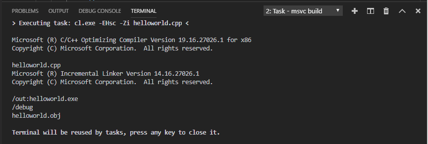

# Getting Started with C++ in VS Code

In this tutorial, you create a simple "Hello World" C++ application in Visual Studio Code on Windows. The tutorial shows how to write and navigate code in the editor, and how to build and debug your program. This tutorial is not intended to teach you about C++ itself. Once you are familiar with the basics of VS Code, you can then follow any tutorial on web, for example, the [C++ Tutorials and Courses](https://hackr.io/tutorials/learn-c-plus-plus) listed on hackr.io.

If you have any problems, feel free to file an issue for this tutorial in the [VS Code documentation repository](https://github.com/Microsoft/vscode-docs/issues).

## Prerequisites

To successfully complete this tutorial, you must first do the following:

1. Install [Visual Studio Code for Windows](https://code.visualstudio.com/docs/?dv=win).

1. Install the [C++ extension for VS Code](https://marketplace.visualstudio.com/items?itemName=ms-vscode.cpptools).

1. Configure VS code for Windows to target one of these environments:
    a. [the Microsoft C++ toolset (MSVC)](cpp-config-msvc.md)
    b. [gcc on Mingw-w64](cpp-config-mingw.md)
    c. [gcc on Windows Subsystem for Linux](cpp-config-wsl.md)

## Navigate to your workspace

If you followed the configuration steps in one of the tutorials in the Prerequisites section, you now have a folder called "hello" on your local machine. That folder contains a .vscode subfolder which contains your configuration files. This folder is your *workspace*. Navigate to it now in a command prompt and type `code .` to open the workspace in VS Code. For MSVC, be sure to use a developer command prompt; press the Windows Start button, then type "developer", and you should see it appear in the results list.

## Create a source file

We need some source code to compile and run. You can supply your own program or use the following example. In either case, name the file `main.cpp` to correspond to the values that you set in the configuration files.

```cpp
#include <iostream>
#include <vector>
#include <string>

using namespace std;

int main()
{

    vector<string> msg {"Hello", "C++", "World", "from", "VS Code!"};

    for (const string& word : msg)
    {
        cout << word << " ";
    }
}
```

## Explore IntelliSense

In your new `main.cpp` file, hover over `vector` or `string` to see type information. After the declaration of the `msg` variable, start typing `msg.` as you would when calling a member function. You should immediately see a completion list that shows all the member functions, and a window that shows the type information for the `msg` object:


## Run the build task

If you configured your workspace according to the instructions in the Prerequisites, you have already defined a default build task that will compiler main.cpp. To run the task, type **Ctrl+Shift+B**. 

You should see the integrated Terminal window appear below the code editor. It shows output from the compiler that indicates whether the build succeeded or failed. For an MSVC build, the output looks something like this:



Notice the four tabs at the top of the window. The **Terminal** tab is an integrated console for your environment. Typicallly this is a Developer Command Prompt console for MSVC or a Bash console for Linux/Mingw; however, you can specify any console you like. The **Debug Console** tab shows output produced by the debugger when you run the program. The **Output** tab shows output from various tools and extensions. The **Problems** tab shows messages from Visual Studio Code when it detects problems with the workspace. 

Go ahead and press a key to close the terminal. You are now ready to debug. Press **F5** or 

